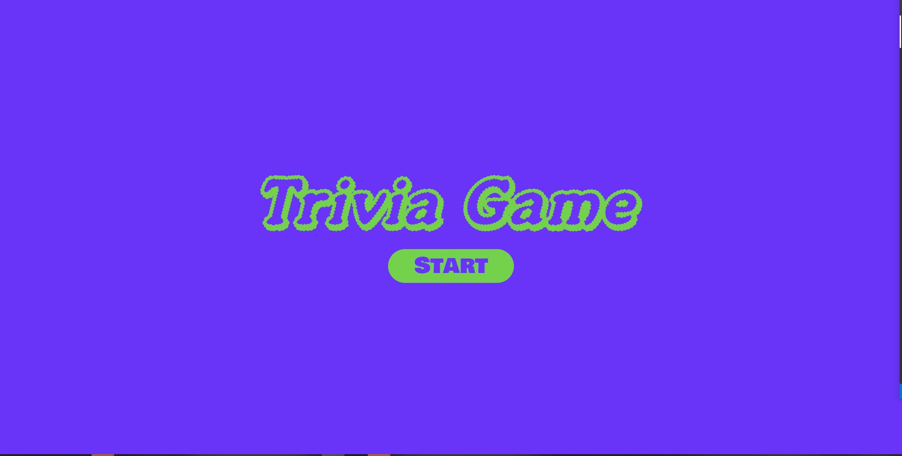
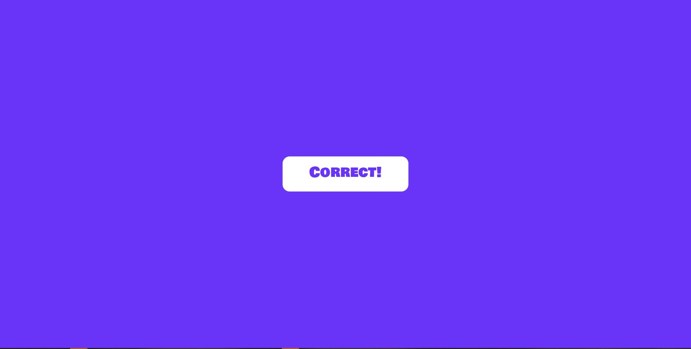

///////////////////// Trivia Game //////////////////

1. User click stgart button to begin the game.
   
2. When the game start, the user has 15 sec to ansewr the question
   
3. The user will get correct/incorrect screen for 3 sec based on his answer
   
4. If the user didnt' click any ansewr withing 15 sec, timeout screen will appear for 3 sec
   
5. At the end of the game the user will get summary of correct/incorrect and unaswred questions and option to reset the game.
   
